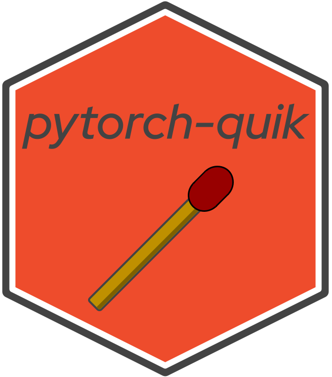

[](https://pypi.org/pypi/name/)
[](https://opensource.org/licenses/BSD-3-Clause)
[](https://quay.io/repository/donchesworth/rapids-dask-pytorch)
[](https://github.com/psf/black)
[](https://codecov.io/gh/donchesworth/pytorch-quik)

# pytorch-quik   

## For the quick-er distibution of neural nets in PyTorch

As I was building out the same set of code for a recommender system, a BERT sentiment model, and a co-worker was about to build a classification model, I decided to standardize the code into this package. It's lightweight, because I didn't want to hide the standard steps to keep the user from learning Neural Networks, but I also didn't want to maintain the code in multiple places.

### Installation

``` bash
pip install pytorch-quik
```

## Usage

### Intro

In its simplest form, you'll want to:

- create a QuikTraveler (an object that "travels" forward and backward on your neural network)
- add QuikData
- add a criterion, an optimizer
- train

``` python
import pytorch_quik as pq
from torch import nn, optim

tr = pq.travel.QuikTraveler()
tr.add_data(pq.io.load_torch_object("train", tr.args))

# from pytorch.org/tutorials/beginner/pytorch_with_examples.html
model = nn.Sequential(nn.Linear(3, 1), nn.Flatten(0, 1))

tr.add_model(model)
tr.set_criterion(nn.MSELoss)
tr.set_optimizer(optim.Adam)

for epoch in range(tr.epochs):
    tr.model.train()
    for batch in tr.data.data_loader:
        users, items, labels = [tens.to(tr.world.device) for tens in batch]
        outputs = tr.model.forward(users, items)
        loss = tr.criterion(outputs, labels)
        tr.backward(loss)
        tr.criterion.step()
    pq.io.save_state_dict(tr.model, tr.args, epoch)
````

### QuikData

A little more about how the data pull works. I usually run my project from my repo, and from the command line. Either way, `QuikData` expects your tensors, models, and state_dicts to be in your current path, and in a `data` subfolder. It will also expect to use your traveler's arguments to determine the date for the filename. You can set it using argparse like I do, or throw it in to your script like this:
``` python
tr = pq.travel.QuikTraveler()
tr.args.data_date = '20210101'
tr.add_data(pq.io.load_torch_object("train", tr.args))
```
The file will also have the words tensor, model, or state_dict in it, train/valid/test if it's a tensor, and e* if it's a state_dict, where e* stands for which epoch the state_dict was saved in. Therefore, the file structure using your repo as the base directory may look like this (I also save my original state_dict to make sure my model is actually training):
- data/train_tensor_20210101.pt
- data/valid_tensor_20210101.pt
- data/test_tensor_20210101.pt
- data/model_20210101.pt
- data/state_dict_eorig_20210101.pt
- data/state_dict_e0_20210101.pt
- data/state_dict_e1_20210101.pt

### Model State

Sometimes your training and validation losses will converge sooner than expected, and you'll want to test an epoch before the final one. this is possible, because the `pq.io.save_state_dict` function will save the weights and biases at the end of the epoch to disk.

### Set_* Functions
Setting the criterion, optimizer, and scheduler just takes a callback, and can use both general defaults and specific ones. For instance, I have an OptKwargs class that can receive parameters via argparse that most optimizers have (lr, weight_decay, eps, and betas), but then you can also feed in specific parameters like `amsgrad=False` if you are using Adam at instantiation like this: `tr.set_optimizer(Adam, amsgrad=False)`. For simplicity I didn't use a scheduler above, but you could include something like `tr.set_scheduler(OneCycleLR)`, and then after your backward, include a `tr.scheduler.step()`.

## Distributed Data Parallel (DDP)

This is really why pytorch-quik is quick-er for me. Adding in DDP can be tough, and I tried to do so and allow you to switch back and forth when necessary. I run my code on an OpenShift cluster, and sometimes can't get on my multi-GPU setup. This allows me to just use a different set of args and just deal with slower code, not broken code!

I would suggest spending time setting up argparse so that you can have your own default arguments for batch size, learning rate, etc, but if you don't want to, you deal with my defaults. These assume you have a GPU on 1 node, which is the simplest benefit from pytorch-quik:

``` python
from argparse import ArgumentParser
parser = pq.args.add_learn_args(ArgumentParser())
args = parser.parse_args()
gpu = 0
tr = pq.travel.QuikTraveler(args, gpu)
tr.run_prep()
```

Notice the addition of providing the QuikTraveler your args, as well as telling it to run on your GPU 0. If you were truly distributing this across GPUs, you'd have to spawn QuikTravelers on each GPU, but more on that later. Also, the tr.run_prep() will start your DDP process_group.

### Automated Mixed Precision (AMP)

Tangentally related is AMP, and if your model.forward() is already set up with mixed precision, this should work for you also. Just add `args.mixed_precision = True` before creating your traveler, and add `with tr.amp.caster` before and within your forward like so (you will have to change your `with autocast():` to be a `with myparam` where myparam is what we're sending in here:
``` python
with tr.amp.caster:
  outputs = tr.model.forward(users, items, tr.amp.caster)
  loss = tr.criterion(outputs, labels)
```
Here is my .forward:
``` python
def forward(self, users, items, caster):
  with caster:
```

### Logging

This isn't true logging, but a good place to talk about the progress bar and metrics. If your training/validation is distributed, your loss will eventually be aggregated with ring-all reduce on each GPU, so it doesn't matter on which one you calculate loss. So, I make your GPU 0 your "logger" GPU, and it will be the one with `tr.world.is_logger = True`. When you see this used, it's just telling the progress bar to be drawn, or the metrics to be calculated.

#### tqdm Progress Bar

One benefit of this is the [tqdm](https://pypi.org/project/tqdm/) progress bar. I didn't bother with the notebook one so that it can work distributed across GPUs, with IPython, or in a Jupyter Notebook. It should look something like this:

```
epoch: 1/2:  22%|████████████▏                                          | 1020/4591 [00:20<01:13, 48.69it/s]
```

I take care of running it only on your first GPU for you, and calculate your steps based on how your bunches distribute across samples. So, your initialization looks like this: 

``` python
trtq = pq.ddp.tq_bar(tr.data.steps, epoch, tr.epochs)
```

and then your update and close are as they would normally be with bar. I also suggest you `del` your bar because it can have trouble drawing the next one if you don't.

#### Metrics

One cool addition that I pulled from fast.ai (thanks fast.ai!) Is the way that they pull training loss and validation loss as they are training, and show them at the end of each epoch so you can see your progress. It works everywhere because it's just a pandas df, and it passes between training and validation because it's a class attribute. (Here we're only using training, so there's zeros). After the backward, you just need a `tr.metrics.add_loss(loss)` to accumulate it, and then after your loop a `tr.metrics.write()` to build the DataFrame. Then you can access it whenever you want at `tr.metrics.results`:

``` python
print(tr.metrics.results)
   epoch    train_loss  valid_loss   time
0      0        0.6435         0.0  05:03
1      1        0.5281         0.0  06:20
```


## Usage Summary

Putting this all together, moving the argument creation into a `main`, and moving the rest into a function (let's call it `train`), which takes just two parameters, `args` and `gpu`. This would be my full example using all the above:

``` python
import pytorch_quik as pq
from torch import nn, optim
from argparse import ArgumentParser

def train(args, gpu):
    tr = pq.travel.QuikTraveler(args, gpu)
    tr.run_prep()

    tr.args.data_date = '20210101'
    tr.add_data(pq.io.load_torch_object("train", tr.args))

    # from pytorch.org/tutorials/beginner/pytorch_with_examples.html
    model = nn.Sequential(nn.Linear(3, 1), nn.Flatten(0, 1))

    tr.add_model(model)
    tr.set_criterion(nn.MSELoss)
    tr.set_optimizer(optim.Adam)
    tr.set_scheduler(OneCycleLR, steps_per_epoch=tr.data.steps)
    if tr.world.is_logger:
        tr.io.save_state_dict(tr.model, tr.args, "orig")

    for epoch in range(tr.epochs):
        if tr.world.is_logger:
            trbar = pq.ddp.tq_bar(tr.data.steps, epoch, tr.epochs)
        tr.model.train()
        for batch in tr.data.data_loader:
            users, items, labels = [tens.to(tr.world.device) for tens in batch]
            with tr.amp.caster:
                outputs = tr.model.forward(users, items, tr.amp.caster)
                loss = tr.criterion(outputs, labels)
            tr.backward(loss)
            tr.scheduler.step()
            tr.metrics.add_loss(loss)
            if tr.world.is_logger:
                trbar.update()
        if tr.world.is_ddp:
            dist.barrier()
        if tr.world.is_logger:
            trbar.close()
            del trbar
            pq.io.save_state_dict(tr.model, tr.args, epoch)
    tr.metrics.write()
    if tr.world.is_logger:
        print(tr.metrics.results)


def main():
    parser = pq.args.add_learn_args(ArgumentParser())
    args = parser.parse_args()
    gpu = 0
    train(args, gpu)


if __name__ == "__main__":
    main()

````

### Spawning across GPUs... or not!

This is why I love pytorch-quik.  then you can use my `traverse` function that will make sure your GPUs are available to PyTorch, and if so, send your training across each GPU! If it decides you can't, it send use that same exact code to the CPU run it on there. This is what they would all look like (I'll abbreviate train):

``` python
import pytorch_quik as pq
from torch import nn, optim
from argparse import ArgumentParser

def train(args, gpu):
...

def main():
    parser = pq.args.add_learn_args(ArgumentParser())
    args = parser.parse_args()
    args.gpus = 4
    pq.ddp.traverse(train, args)


if __name__ == "__main__":
    main()
```

#### Running from command line

Now, you can package your repo, not even touch the code, and run it on four GPUs like `python main.py --gpus 4`, on one gpu when there are four like `python main.py --gpus 1`, or throw it on a cluster, let the cluster decide where to run it, and when you run `python main.py`, pytorch-quik will _determine if you have GPUs and whether it should distribute or not!_

Cool, huh.

Let me know if you have any questions, and I'll keep adding to this documentation!
